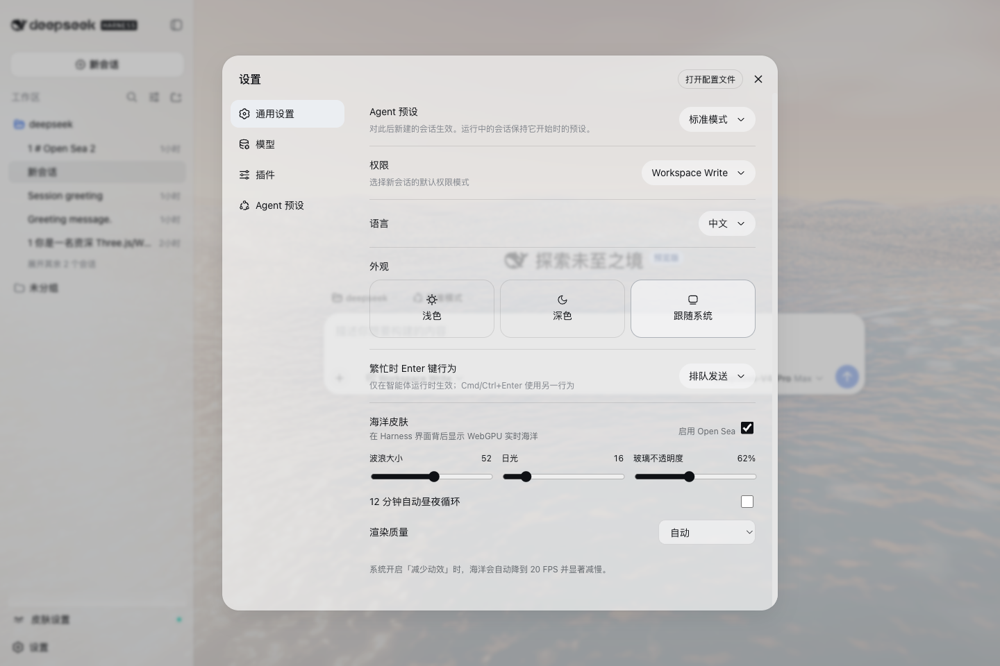
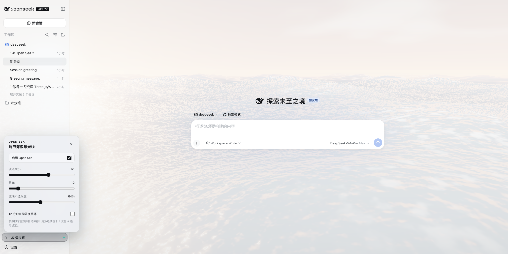
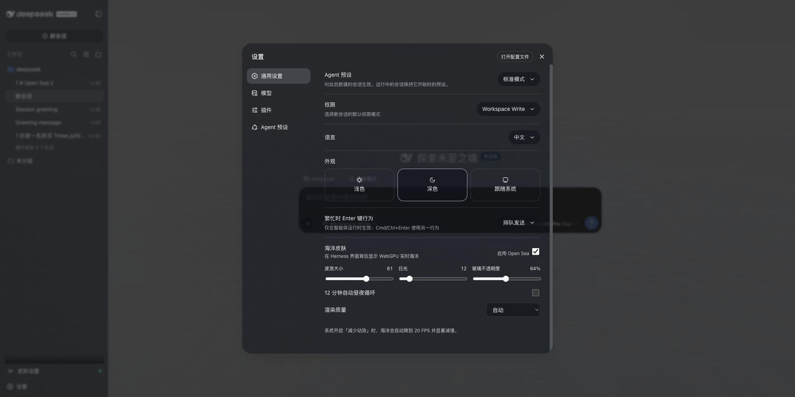
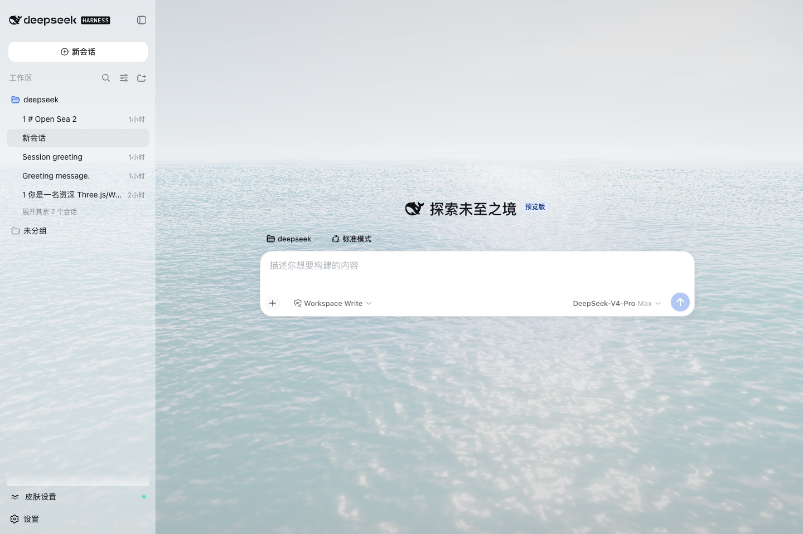
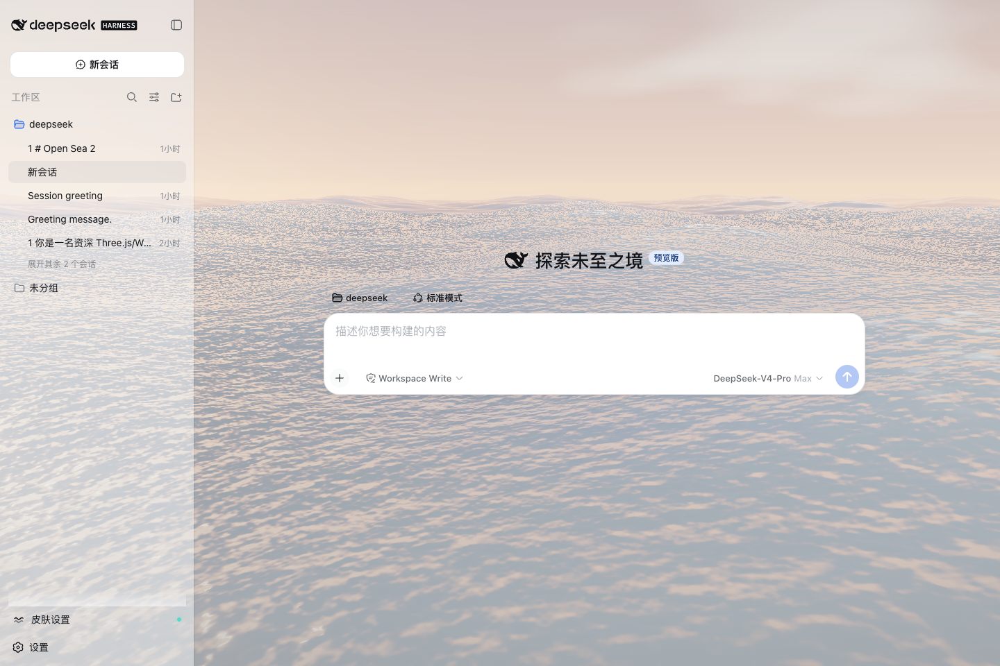
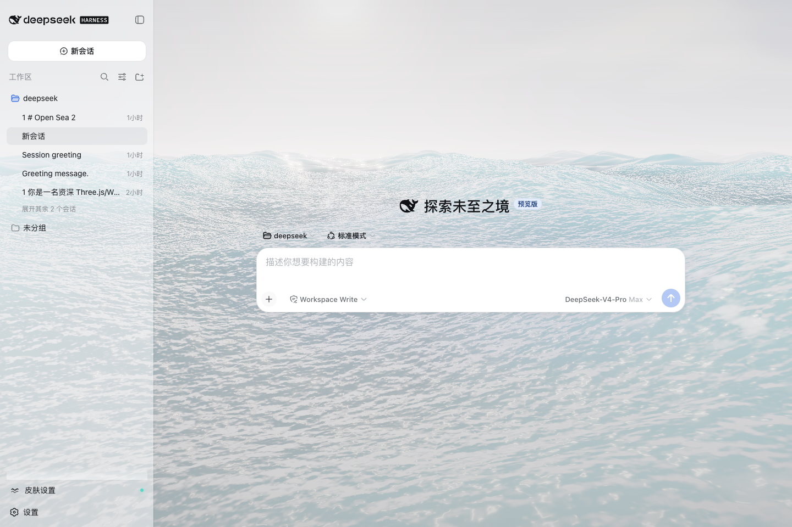
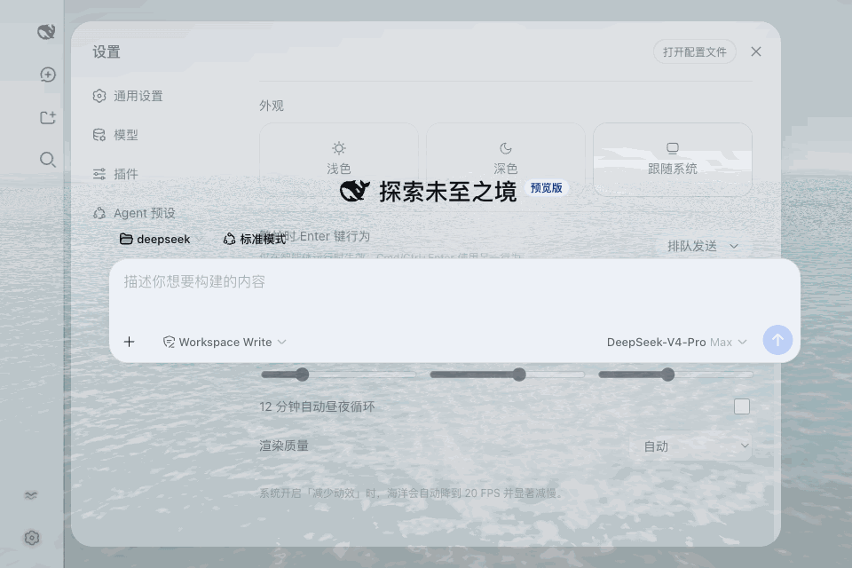

# Open Sea 海洋皮肤

[English](README.md) · [技术架构](docs/architecture.md) · [发布说明](docs/releasing.md)

把实时 WebGPU 海洋同时带到浏览器新标签页和 DeepSeek Harness。保留五组
Gerstner 波与 TSL 海面视觉，增加半透明玻璃界面，并提供浏览器扩展、无需编译的
dist 安装脚本，以及真正接入 Harness slots/settings 的原生客户端插件。



## 效果图

| 左下角原生快捷面板 | 超宽深色设置页层级修复 |
| --- | --- |
|  |  |

| 平静海面 | 夕阳 | 大浪 |
| --- | --- | --- |
|  |  |  |



## 安装方式一：Chrome / Edge 扩展

1. 下载并解压 Release 中的 `open-sea-skin-extension-*.zip`，或克隆本仓库。
2. 打开 `chrome://extensions`（Edge 为 `edge://extensions`），开启右上角
   **开发者模式**。
3. 点击**加载已解压的扩展程序**，选择本仓库的 `extension/` 文件夹。
4. 新建标签页可看到完整海洋；打开 `127.0.0.1` 或 `localhost` 上的 Harness
   即可看到玻璃海洋背景。

工具栏弹窗可以只关闭 Harness 皮肤。左下角的波浪图标可调波浪、日光和玻璃
不透明度，数值会保存到 `chrome.storage.sync`。

## 安装方式二：Harness dist 注入（无需编译源码）

克隆本仓库后执行：

```sh
bash native-dist/install-skin.sh
```

脚本会自动寻找已构建/已安装的 Harness 前端，先备份 `index.html`，再复制本地
资源并注入一段带标记的加载代码。找不到时可显式指定：

```sh
bash native-dist/install-skin.sh --dist /绝对路径/apps/web/dist
```

**每次 Harness 升级后必须重跑**：

```sh
bash native-dist/install-skin.sh --update
```

安全卸载：

```sh
bash native-dist/install-skin.sh --uninstall
```

脚本只删除自己的标记块和 `open-sea-skin/` 目录，不会用旧备份覆盖 Harness
后续更新。自动定位和恢复细节见 [native-dist/README.md](native-dist/README.md)。

## Harness 原生源码插件

希望设置项直接出现在 Harness「通用设置」中，可接入原生包：

```sh
git clone https://github.com/deepseek-ai/deepseek-harness.git
bash harness-plugin/install-into-harness.sh /绝对路径/deepseek-harness
cd /绝对路径/deepseek-harness
corepack pnpm install
corepack pnpm run build
corepack pnpm dsh web
```

启动后可直接点击左下角原生的**皮肤设置**快捷入口，也可打开
**设置 → 通用设置 → 海洋皮肤**查看完整选项。两处都使用 Harness 自己的
settings、locale、slots 和可逆主题令牌 API，不依赖 CSS Modules 哈希。接入
脚本已在 Harness 提交 `47f943859bef`（2026-08-13）验证；若上游结构变化，
脚本会停止并明确报错，不会猜测改文件。详见
[harness-plugin/README.zh.md](harness-plugin/README.zh.md)。

## 已完成优化

- WebGPU + three.js 0.178.0 + TSL；五组 Gerstner 波、解析法线、FBM 细节、
  Fresnel 天空反射、太阳闪烁、浪尖泡沫、地平线雾、天空云带、bloom 与 ACES。
- 扩展和两种 Harness 安装均为本地资源，不请求 CDN，不含分析或遥测。
- 256×256 网格；低端/减少动态模式为 160×160；DPR 上限 1.5；0.5–1.0
  自适应分辨率；60/30/20 FPS 档；标签隐藏暂停；远处跳过昂贵片元细节；皮肤
  模式降低 bloom；自动识别低端设备。
- 12 分钟自动昼夜循环；手动拖动「日光」会固定当前时间，可再次开启自动循环。
- 扩展和 dist 方案共用同一个 host controller，仅持久化适配层不同。
- 三条安装路径共用 DOM 标记，避免同时安装时重复启动 WebGPU 渲染器。
- 中英双语、键盘焦点循环、Esc 关闭、ARIA、`prefers-reduced-motion` 降级。
- 修正超宽窗口下的层叠上下文：设置对话框始终位于聊天输入框之上，海洋始终
  位于三栏界面之后。

`site/` 是最初版展示站点，按要求逐字节保留。优化版的唯一源码在 `shared/`，
执行 `npm run build` 后生成三份安装资源。

## 开发与验证

Node.js 20+：

```sh
npm run build
npm run check
npm run package:extension
```

真实浏览器验收需要 Chrome for Testing 与 Playwright：

```sh
npm ci
npx playwright install chromium
npm run test:browser
```

测试使用持久化浏览器目录、`--load-extension`，并设置
`ignoreDefaultArgs: ['--disable-extensions']`。这是 Chrome 137+ 环境加载未打包
扩展所需方式。`npm run capture` 会重新生成 README 中的 PNG 与 GIF。

## 隐私与权限

本项目**不收集、不上传、不出售、不共享任何数据**。扩展仅申请 `storage`，以及
`http://127.0.0.1/*`、`http://localhost/*` 两个本机地址权限，用于给本地 Harness
换肤；没有远程网站权限。详见 [docs/privacy.md](docs/privacy.md)。

## 许可

项目源码使用 [MIT License](LICENSE)。three.js 0.178.0 仍为 MIT；自托管 Geist
字体仍为 SIL OFL 1.1。完整说明见 [THIRD_PARTY_NOTICES.md](THIRD_PARTY_NOTICES.md)。
